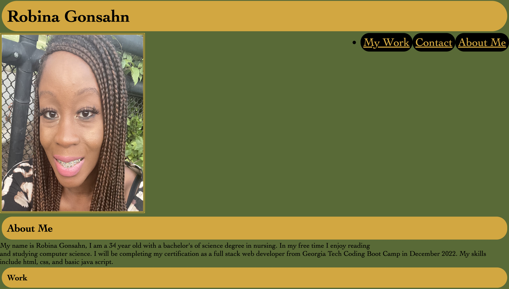

# robina-week-2-challenge
# Introduction
 This project showcases my introductory skills in web design. I will update this page as my skills grow during this program. The portfolio has an image of me, an interactive navigation bar at both the header and footer of the UI. The work section will eventually deploy my future applications once they are completed. 

 # Description
 I used the advanced CSS skills such as flexbox and media queries in lines 71-76 and lines 93-97 to not only create a responsive layout with veiwport compatibility on most devices, but to add uniformity to my images as well. This is seen in lines 78-84. Unique identifiers were set in lines 37-40 to correlate with the corresponding ID's in lines 57, 65, and 83. This code enabled scrolling to the appropriate veiwing area on the UI whenever the links in the navigation page are clicked on. This efficient features allows viewers to access and read through content in a more efficient manner. A contact navigation bar is used for networking purposes, and an email browser link opens when the email link is clicked on as an added bonus! I used an array of css styles, and colors, border-radius, border-style, and padding to name a few. The float property served especially helpful when adding my navigation bar. I used the float-right property to horizontally align my navigation bar to the right of my portfolio photo. 

 # Try It Out 
 You can test the functionality of the page by opening Chrome "dev" tools, clicking on the device toggle tool bar by zooming in and out, it can be observed that the viewport adjust with the applicable device. The images transition from a horizontal row to a vertical column as the image adjust to a smaller screen from a desktop. 

 # Set Up 
 Run the code in the bowser by following the url link below
[ website link](https://rgonsahn.github.io/robina-week-2-challenge/)

